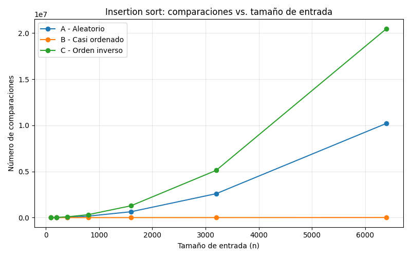
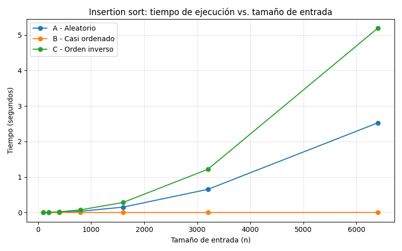
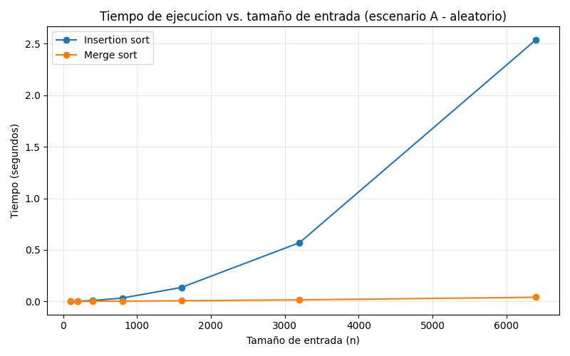

# Laboratorio evaluativo 01 - Fundamentos, complejidad y recurrencias

**Nombre:** David Stiven Franco Lopez
**Caso:** Plataforma Tamiza — Secretaría de Salud departamental

## Instrucciones para reproducir el experimento

Desde la raiz del repositorio, con el entorno virtual activado:

```bash
source venv/Scripts/activate
pip install -r requirements.txt
cd lab1-fundamentos-complejidad-recurrencias
```

Para correr el experimento de la Parte 3:

```bash
python parte3_casos.py
```

Para correr el experimento de la Parte 4:

```bash
python parte4_complejidad.py
```

Ambos scripts generan las graficas correspondientes en la carpeta `graficas/`.

**Nota sobre el sentido de ordenamiento:** en este laboratorio, `insertion_sort` y `merge_sort` ordenan de menor a mayor. Esta eleccion no cambia ninguna complejidad calculada; solo determina que el escenario B (casi ordenado) queda ascendente y el escenario C (orden inverso) queda descendente.

---

## Parte 1

### Analizar el algoritmo antes de comprar hardware

Como vemos la plataforma Tamiza lleva ocho años dando el resultado correcto. Cada madrugada, insertion sort logra ordenar los 1.200.000 registros según el índice de riesgo. El problema que nos encontramos realmente no es que el algoritmo esté mal, sino que tiene un problema que yo lo veo como un requerimiento no funcional y es que ya no está siendo lo suficientemente rápido para cumplir con el tiempo disponible. Ya que el proceso debe completarse dentro de la ventana de cuatro horas (2:00 a.m. a 6:00 a.m.), porque a las 6:00 a.m. el centro de contacto empieza a llamar siguiendo esa lista. En las últimas semanas el proceso no ha terminado a tiempo en tres ocasiones. Por eso, la dificultad principal está en el tiempo de ejecución y no en la corrección del algoritmo. Un algoritmo puede funcionar correctamente, pero si tarda demasiado para las condiciones reales del problema, deja de ser una solución adecuada.

Duplicar la velocidad del servidor podría ayudar por un tiempo, pero no solucionaría el problema principal. Esto se debe a que insertion sort tiene un crecimiento cuadrático (O(n²)) en el peor caso. Por ejemplo, si la cantidad de datos se duplica, el tiempo de ejecución puede aumentar aproximadamente cuatro veces. El programa pasó de trabajar con 4 municipios y 20.000 registros a trabajar con todo el departamento y 1.200.000 registros. Este aumento es demasiado grande para depender solamente de mejoras en el hardware. Aunque un procesador más rápido pueda reducir el tiempo actualmente, si los datos siguen creciendo, el problema volverá a aparecer. Por eso considero que sería una solución temporal y no una solución al problema de fondo.

Algo parecido podría pasar en un sistema de dashboards de seguridad en el que he trabajado (Florida parque comercial). Por ejemplo, si una función tuviera que comparar todos los eventos de seguridad con todos los turnos de vigilancia registrados durante un mes, podría funcionar bien cuando existen pocos cientos de eventos. Sin embargo, si el centro comercial empieza a generar miles de eventos diarios y el reporte necesita aparecer en pocos segundos en un dashboard en tiempo real, ese mismo proceso podría volverse demasiado lento. Los datos seguirían siendo procesados correctamente, pero ya no se cumpliría con el tiempo de respuesta que necesita el sistema. En ese caso, al igual que con Tamiza, el problema no sería que el resultado estuviera mal, sino que el algoritmo utilizado no sería adecuado para la cantidad de datos y el tiempo disponible.

---

## Parte 2

### Responsabilidad ambiental y ética de la implementación

**Dimensión medioambiental:** Tamiza, funciona noche tras noche, y el proceso de ordenamiento tiene lugar cada mañana en tiempo real. Por ende, el consumo energético del algoritmo (como dijo el profesor en clase, como ingenieros concientizados que somos) es otro factor a tener en cuenta. entonces, debemos preocuparnos por la diferencia en el consumo energético entre el ordenamiento por inserción y un algoritmo más eficiente. Insertion sort presenta una complejidad de O(n²), lo que significa que, a medida que aumenta el tamaño de la matriz, el tiempo necesario para ordenarla aumenta exponencialmente. Es posible que el algoritmo concreto utilizado para ordenar las 1.2 millones de matrices no sea decisivo; sin embargo, dado que este proceso se lleva a cabo todos los días y que el coste energético de ordenar una única matriz se multiplica por cada día del año, la diferencia entre un algoritmo de O(n log n) y uno de O(n²) podría tener repercusiones medioambientales significativas.

**Dimensión ética:** El aumento del tiempo necesario para completar el proceso de ordenamiento podría tener varias consecuencias. En primer lugar, un paciente con un índice de riesgo alto podría tener que esperar a una intervención quirúrgica más que si la lista hubiera sido ordenada a tiempo. El fraude puede ser consecuencia del hecho de que la lista no estuviera ordenada antes de la hora límite de las 6:00, si bien es claro que sería el paciente quien asumiría el coste del error, no la secretaría ni el equipo de desarrollo del sistema. La segunda consideración ética se refiere al operador del centro de atención al cliente. Si recibe una lista desordenada o incompleta, podría empezar a llamar a los pacientes que ocupan anteriormente en la lista aunque aún no hayan sido evaluados, argumentando que están priorizados.

**Tensión entre orden y corrección:** El problema de ordenar una lista de pacientes con base en sus índices de riesgo presenta una tensión entre el orden y la corrección. El orden de la lista afecta a las prioridades de los médicos, puesto que los pacientes listados primero tienen una prioridad más alta y serán atendidos primero; por lo tanto, debe encontrarse un equilibrio entre la velocidad a la que se ordena la lista y la exactitud del resultado. El sistema tiene cuatro horas para completar el proceso de ordenamiento antes de que se cierre el servicio, y no debe invertir más tiempo del necesario en intentar mejorar el orden de la lista.

---

## Parte 3

Codigo: [algoritmos.py](algoritmos.py) | [datos.py](datos.py) | [codigo de la Parte 3](parte3_casos.py)

## Peor caso, mejor caso y caso promedio, demostrados en Python

### 3.1 - Explicacion

Los tres casos de analisis se definen sobre el mismo conjunto de entradas: todas las listas posibles de un tamanio fijo n. Lo que cambia es que estadistico se toma sobre ese conjunto:

- **Peor caso:** el maximo del tiempo (o de las comparaciones) sobre todas las entradas posibles de tamanio n. Es la mayor garantía: ninguna entrada de ese tamanio puede tardar mas que eso.
- **Mejor caso:** el minimo sobre el mismo conjunto de entradas de tamanio n. Es la situacion mas favorable posible, pero no algo con lo que se pueda contar en produccion.
- **Caso promedio:** el promedio del tiempo (o comparaciones) sobre todas las entradas posibles de tamanio n, asumiendo una distribucion de probabilidad sobre esas entradas (tipicamente, que cualquier permutacion es igual de probable).

Para decidir si el algoritmo de Tamiza entra en produccion, el caso relevante es el **peor caso**, no el promedio ni el mejor. La ventana de cuatro horas es una restriccion dura, no una expectativa estadistica: si el sistema falla incluso una sola madrugada porque le toco una entrada desfavorable, el daño ya ocurrio (pacientes de alto riesgo sin contactar). Diseñar contra el peor caso es la unica forma de garantizar que el sistema cumple la restriccion siempre, no "en promedio".

**Prediccion antes de medir:** el escenario C (orden inverso) deberia ser el peor caso para insertion sort, porque cada elemento nuevo debe recorrer y desplazar absolutamente todos los elementos ya colocados antes de encontrar su posicion. El escenario B (casi ordenado) deberia ser el mejor caso, porque el 98% de la lista ya esta en su posicion final. El escenario A (aleatorio) deberia quedar en un punto intermedio, aproximandose al caso promedio.

### 3.2 - Demostracion experimental





Los resultados confirman exactamente la prediccion de 3.1. El escenario C (orden inverso) resulto ser el peor caso: a n=6400 genero cerca de 20,5 millones de comparaciones y tardo aproximadamente 5,2 segundos, el punto mas alto de ambas graficas. El escenario B (casi ordenado) resulto ser el mejor caso: su curva se mantiene practicamente plana y cercana a cero incluso en n=6400 (unas 10 mil comparaciones, menos de un milisegundo), porque el algoritmo solo necesita insertar el 2% desordenado del final. El escenario A (aleatorio) quedo consistentemente entre los otros dos en ambas graficas, comportandose como una aproximacion razonable al caso promedio.

No hubo contradicción con la prediccion: la forma de las tres curvas en la grafica de comparaciones y en la de tiempo coincide con lo anticipado, lo que confirma en la practica el comportamiento cuadratico (O(n^2)) de insertion sort en su peor y caso promedio, frente al comportamiento casi lineal cuando la entrada ya esta casi ordenada.

---
## Parte 4

### 4.1 - Calculo teorico


**Recurrencia de merge sort**

La recurrencia es:

```
T(n) = 2T(n/2) + Θ(n)
```

De dónde sale cada término: merge sort divide la lista de tamaño `n` en **2 subproblemas** (las dos mitades), cada uno de tamaño **n/2** — de ahí el `2T(n/2)`. Después de ordenar recursivamente cada mitad, el paso de "combinar" (mezclar las dos mitades ya ordenadas en una sola lista ordenada) requiere recorrer los `n` elementos una sola vez, comparando de a un elemento de cada mitad a la vez — de ahí el término `Θ(n)`, el costo de la mezcla.

**Resolución por el método maestro**

El método maestro aplica a recurrencias de la forma `T(n) = a·T(n/b) + f(n)`. Identificando los ingredientes:

-   `a = 2` (número de subproblemas)
-   `b = 2` (factor de reducción del tamaño)
-   `f(n) = Θ(n)` (costo de combinar)

Se calcula `n^(log_b a) = n^(log_2 2) = n^1 = n`.

Comparando `f(n)` con `n^(log_b a)`: `f(n) = Θ(n)` es asintóticamente igual a `n^(log_b a) = Θ(n)`. Esto corresponde exactamente al **Caso 2** del método maestro (cuando `f(n) = Θ(n^(log_b a))`), cuya conclusión es:

```
T(n) = Θ(n^(log_b a) · log n) = Θ(n log n)
```

Se verifica explícitamente la condición del Caso 2: `f(n)` debe ser `Θ(n^(log_b a))`, y en efecto `f(n) = Θ(n) = Θ(n^1) = Θ(n^(log_2 2))` — la condición se cumple exactamente, sin necesidad de factores logarítmicos adicionales. Por lo tanto, **merge sort tiene complejidad Θ(n log n)** en todos los casos (peor, mejor y promedio), porque la recurrencia no depende de cómo estén ordenados los datos de entrada: siempre divide a la mitad y siempre mezcla los `n` elementos, sin importar su orden inicial.

**Cálculo de insertion sort línea a línea**

Tomando la implementación de `algoritmos.py`:

python

```python
for i in range(1, len(lista)):        # se ejecuta n-1 veces
    actual = lista[i]                  # n-1 veces, costo O(1) cada una
    j = i - 1                          # n-1 veces, costo O(1) cada una
    while j >= 0:                      # se ejecuta t_i veces en la iteración i
        comparaciones += 1             # t_i veces
        if lista[j] > actual:          # t_i veces
            lista[j + 1] = lista[j]    # hasta t_i veces
            j -= 1                     # hasta t_i veces
        else:
            break
    lista[j + 1] = actual              # n-1 veces, costo O(1) cada una
```

Sea `t_i` el número de veces que se ejecuta el `while` interno en la iteración `i`-ésima del `for` externo (equivalente a cuántas posiciones se desplaza el elemento `actual`).

-   **Mejor caso** (lista ya ordenada): cada elemento nuevo se compara una sola vez y no se desplaza, así que `t_i = 1` para todo `i`. El costo total es `Σ(i=1 hasta n-1) O(1) = O(n)`. **Insertion sort es O(n) en el mejor caso.**
-   **Peor caso** (lista en orden inverso): cada elemento nuevo debe desplazarse hasta el principio, así que `t_i = i`. El costo total es `Σ(i=1 hasta n-1) i = (n-1)n/2 = O(n²)`. **Insertion sort es O(n²) en el peor caso.**
-   **Caso promedio**: en promedio, cada elemento se desplaza aproximadamente la mitad de su posición, así que `t_i ≈ i/2`. La suma sigue siendo del orden de `n²/4`, que asintóticamente es **O(n²)**.

**Tabla de complejidades**

| Algoritmo | Mejor caso | Caso promedio | Peor caso |
|---|---|---|---|
| Insertion sort | O(n) | O(n^2) | O(n^2) |
| Merge sort | Θ(n log n) | Θ(n log n) | Θ(n log n) |


### 4.2 - Validacion experimental

Codigo: [codigo de la Parte 4](parte4_complejidad.py)




La grafica muestra que, para tamanios pequenios (n=100), insertion sort y merge sort tardan tiempos muy similares -merge sort incluso puede verse comparable o levemente mas lento, porque paga el costo de crear listas nuevas y llamar funciones recursivas, y esas constantes pesan mas que la ventaja asintotica en entradas chicas. A partir de n=200 la diferencia se vuelve evidente: insertion sort crece de forma cuadratica (su curva se curva hacia arriba cada vez mas empinada), mientras que merge sort se mantiene casi plano. En n=6400, insertion sort tarda decenas de veces mas que merge sort. Esto coincide exactamente con las complejidades calculadas en 4.1: O(n^2) frente a Θ(n log n) es justo la forma de curva que se observa, y confirma que para Tamiza, con 1.200.000 registros, merge sort es la opcion adecuada.

### 4.3 - Concepto tecnico a la Secretaria de Salud

Al equipo de ingenieria de la Secretaria de Salud:

Recomiendo reemplazar insertion sort por **merge sort** como algoritmo de ordenamiento del proceso nocturno de Tamiza. La razon central es que el canal de entrada de los registros puede cambiar sin aviso (cargue directo, reproceso, migracion desde el sistema legado), y el equipo no quiere mantener tres implementaciones distintas ajustadas a cada escenario. Merge sort resuelve este problema porque su complejidad es Θ(n log n) en todos los casos -mejor, peor y promedio-, sin importar como vengan ordenados los datos de entrada. Insertion sort, en cambio, solo es rapido cuando la entrada ya esta casi ordenada (escenario B); frente a un cargue aleatorio o a una migracion en orden inverso, degrada a O(n^2). Adoptar merge sort evita tener que anticipar o detectar el escenario de entrada: su desempenio es predecible y estable frente a cualquier canal.

**Extrapolacion a 1.200.000 registros (estimacion, no medicion):** con los tiempos medidos en la Parte 4.2 sobre el escenario aleatorio en n=6400 (insertion sort ≈ 2,54 s; merge sort ≈ 0,045 s), y escalando segun la forma de cada curva (n^2 para insertion sort, n log n para merge sort) hasta un tamanio 187,5 veces mayor, la proyeccion es: insertion sort tardaria en el orden de casi 25 horas para 1.200.000 registros -muy por encima de la ventana de 4 horas, coherente con los fallos ya reportados-, mientras que merge sort tardaria en el orden de 13 a 14 segundos, dejando un margen enorme dentro de la ventana. Es importante subrayar que esto es una extrapolacion a partir de mediciones hasta n=6400, no una medicion directa sobre 1.200.000 registros; el comportamiento real podria variar por factores de memoria, cache o carga del servidor que no se capturan al escalar la formula.

**Sobre la propuesta de duplicar la velocidad del servidor:** la grafica de la Parte 4.2 muestra que, en n=6400, insertion sort tardo aproximadamente 56 veces mas que merge sort. Duplicar la velocidad del hardware reduciria el tiempo de insertion sort a la mitad -de casi 25 horas a poco mas de 12 horas extrapoladas-, lo cual sigue muy por encima de la ventana de 4 horas. Y esa brecha no hace mas que ensancharse a medida que el volumen de registros siga creciendo, porque una mejora de hardware es una constante multiplicativa, mientras que la diferencia entre O(n^2) y O(n log n) crece con n. Comprar el servidor no resuelve el problema, ni siquiera lo pospone de forma util.

**Consideracion adicional - memoria:** a diferencia de insertion sort, que ordena en el mismo espacio (in-place), merge sort necesita memoria auxiliar proporcional a n para las listas temporales que crea en cada mezcla. Para 1.200.000 registros esto es perfectamente manejable con la memoria de un servidor estandar, pero es un costo que insertion sort no tiene y que el equipo de infraestructura debe tener presente al dimensionar el servidor, junto con la ventaja en tiempo que se gana a cambio.

En sintesis: recomiendo migrar a merge sort antes de invertir en hardware adicional. Los datos medidos muestran que, incluso duplicando la velocidad del servidor, insertion sort seguiria sin caber en la ventana de cuatro horas, mientras que merge sort deja un margen de horas de sobra frente a los 1.200.000 registros diarios.

