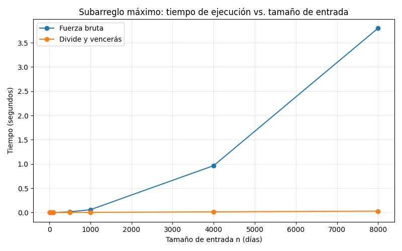

# Laboratorio evaluativo 02 - Dividir y vencer

**Nombre:** David Stiven Franco Lopez
**Caso:** Cooperativa de tiendas de barrio

## Instrucciones para reproducir el experimento

Desde la raiz del repositorio, con el entorno virtual activado:

En Windows (Git Bash):
```bash
source venv/Scripts/activate
pip install -r requirements.txt
cd lab2-divide-y-vencer
```

En macOS/Linux:
```bash
source venv/bin/activate
pip install -r requirements.txt
cd lab2-divide-y-vencer
```

Para verificar las dos soluciones:
```bash
python pruebas.py
```

Para correr el experimento y generar la grafica:
```bash
python medicion.py
```

Cada tiempo reportado es la **mediana de 5 repeticiones** sobre la misma serie, para reducir el ruido de mediciones individuales (ver funcion `medir` en `medicion.py`).

**Entorno de pruebas:**

-   **Sistema Operativo:** Windows 10 (Versión 22H2)
-   **Lenguaje:** Python 3.10.0
-   **Librería gráfica:** Matplotlib 3.10.9

---

## Parte 1 - Implementar y verificar las dos soluciones

Codigo: [subarreglo.py](subarreglo.py) | [pruebas.py](pruebas.py)

La función `subarreglo_fuerza_bruta` recorre todos los pares de dias (i, j) acumulando la suma dentro del ciclo interno, por lo que su costo es Θ(n²) y no Θ(n³). `subarreglo_maximo` resuelve los tres casos posibles (mejor tramo en la mitad izquierda, en la mitad derecha, o cruzando el punto medio), este ultimo calculado por `suma_cruzada` con dos barridos lineales desde el centro hacia cada lado, y devuelve el mejor de los tres sin llamar en ningun momento a la fuerza bruta.

`pruebas.py` verifica, ademas de que las dos soluciones coincidan en la suma: que ninguna modifique la lista de entrada, y que los indices devueltos por cada una realmente sumen el valor que reportan (no solo que la suma sea correcta por casualidad). Los casos cubiertos son:

- La serie de ocho dias de la situacion problema (suma esperada 17).
- Series de un solo elemento, positivo y negativo.
- Series con todos los valores negativos, donde la respuesta es el dia menos malo.
- Series con todos los valores positivos, donde la respuesta es la serie completa.
- Dos casos donde el mejor tramo cruza el punto medio, verificados tambien contra `suma_cruzada` por separado.
- Veinte listas aleatorias de tamaño y contenido variable, con semilla fija (17), en las que ambas soluciones deben coincidir.

---

## Parte 2 - Medir y graficar

Codigo: [medicion.py](medicion.py)



Medi 7 tamaños de entrada (10, 50, 100, 500, 1000, 4000 y 8000 dias), dos de ellos menores de 100, generados con semilla fija (42) para que el experimento sea reproducible. En cada tamaño ambos algoritmos reciben la misma lista, y el propio script verifica con un `assert` que las dos soluciones coinciden en la suma antes de registrar el tiempo. El cronometro (`time.perf_counter()`) mide unicamente la llamada al algoritmo, nunca la generacion de los datos.

A continuación, se agrega la tabla de valores medidos para poder leer los tamaños pequeños:

| n (dias) | Fuerza bruta (s) | Divide y vencerás (s) |
|---:|---:|---:|
| 10 | 0,000010 | 0,000025 |
| 50 | 0,000151 | 0,000145 |
| 100 | 0,000565 | 0,000301 |
| 500 | 0,014987 | 0,001726 |
| 1.000 | 0,058394 | 0,003299 |
| 4.000 | 0,966813 | 0,014303 |
| 8.000 | 3,799113 | 0,029594 |

---

## Parte 3 - Analisis

### 1. Recurrencia

`subarreglo_maximo` divide la serie en dos mitades y se llama recursivamente sobre cada una, lo que da dos subproblemas de tamaño n/2 (a=2, b=2). El trabajo que queda fuera de esas llamadas es el caso cruzado: `suma_cruzada` hace dos barridos lineales desde el centro hacia cada lado, que entre los dos recorren cada elemento una sola vez, así que cuesta Θ(n). Comparar los tres resultados (izquierdo, derecho, cruzado) es Θ(1). Con el caso base T(1) = Θ(1), la recurrencia queda `T(n) = 2T(n/2) + Θ(n)`.

Aplicando el método maestro: a=2, b=2, f(n)=Θ(n), y n^(log_b a) = n^(log₂2) = n. Como f(n) es del mismo orden que n^(log_b a), aplica el Caso 2, y la solución es T(n) = Θ(n^(log_b a) · log n) = **Θ(n log n)**.

La fuerza bruta es Θ(n²) porque recorre todos los pares (i, j), que son del orden de n²/2, y como acumulo la suma dentro del ciclo en vez de recalcularla desde cero para cada par, cada uno de esos pares cuesta un trabajo constante.

### 2. Lo medido contra lo esperado

En mi gráfica, la curva de fuerza bruta se dispara con una curvatura cada vez más pronunciada, mientras que divide y vencerás se mantiene casi pegada al eje horizontal en toda la escala. Tomando los dos últimos tamaños (4.000 y 8.000, que duplican n): fuerza bruta pasó de 0,9668s a 3,7991s, un factor de **×3,93**, muy cerca del ×4 que predice Θ(n²). Divide y vencerás pasó de 0,0143s a 0,0296s, un factor de **×2,07**, cercano al ×2,17 que predice Θ(n log n) (calculado como 2 × log₂(8000)/log₂(4000)). Las dos mediciones coinciden con lo que la teoría anticipa, con una diferencia pequeña explicable por el ruido normal de medir tiempos tan cortos.

### 3. Tamaños pequeños

Sí hay un cruce, y está entre n=10 y n=50. En n=10, fuerza bruta gana (0,000010s contra 0,000025s de divide y vencerás); en n=50 ya pierde (0,000151s contra 0,000145s). Esto tiene sentido: con series muy cortas, divide y vencerás paga el costo de las llamadas recursivas y de crear nuevas tuplas en cada nivel, un costo fijo que pesa más que su ventaja asintótica cuando n es tan pequeño. A partir de ahí, la ventaja de Θ(n log n) empieza a notarse y nunca se revierte.

### 4. ¿Cuándo conviene dividir?

Para hallar el máximo de un arreglo, dividir no ayuda. La recurrencia sería `T(n) = 2T(n/2) + Θ(1)`, porque combinar es solo una comparación entre los dos máximos parciales. Por el método maestro, f(n)=Θ(1) crece más despacio que n^(log_b a)=n, así que cae en el Caso 1 y da T(n) = Θ(n) — exactamente lo mismo que recorrer el arreglo una sola vez, pero con el costo adicional de la recursión. La diferencia con el subarreglo máximo es que ahí combinar cuesta Θ(n) y reemplaza un trabajo que en la fuerza bruta costaba Θ(n²): hay una ganancia real que pagar. En el máximo no hay nada que ahorrar, porque ya hay que mirar los n números al menos una vez de cualquier forma.

### 5. Concepto para la gerente

Claramente recomiendo divide y vencerás. Con los historiales actuales de unos 2.000 días la diferencia es de milisegundos y casi no se nota, pero el equipo planea analizar series de sensores con cientos de miles de registros, y ahí la fuerza bruta deja de ser viable. **Esto es una estimación, no una medición directa:** extrapolando desde n=8.000 (mi medición más grande) hasta 1.000.000 de registros, el tamaño se multiplica por 125. La fuerza bruta crece con el cuadrado, así que su tiempo se multiplica por 125² = 15.625: los 3,80s medidos se convierten en unas **16,5 horas**. Divide y vencerás crece con n log n, con un factor de (1.000.000·log₂1.000.000)/(8.000·log₂8.000) ≈ 192: los 0,0296s medidos se convierten en apenas **5,7 segundos**.
